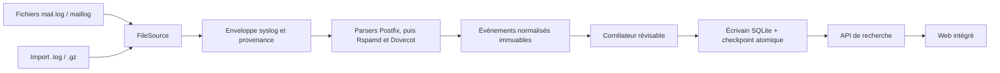

# QueueAtlas — conception de phase 0

**Statut : validé par le propriétaire le 3 octobre 2026.** Ce document décrit une cible de développement ; il ne décrit pas un logiciel déjà disponible. Le nom QueueAtlas et la licence MIT sont confirmés. Le dépôt GitHub conserve pour l'instant son URL historique [Coubiac/mailtrace](https://github.com/Coubiac/mailtrace).

## 1. Nom et licence

« MailTrace » est un nom de travail déjà utilisé par [d'autres dépôts GitHub](https://github.com/search?q=MailTrace&type=repositories). Vérification préliminaire par recherche de dépôts GitHub et recherche Web exacte le 3 octobre 2026 : aucune collision évidente relevée pour les six propositions suivantes, mais cela ne constitue **ni** une recherche de marque **ni** une vérification des domaines ou registres de paquets.

| Proposition | Intérêt | Réserve |
| --- | --- | --- |
| QueueAtlas | Parcours et vue d'ensemble, court | Le mot « queue » peut être peu clair hors administration mail |
| QueueWitness | Met l'accent sur les faits observés | Sonorité plus longue |
| PostfixTrail | Immédiatement reconnaissable pour le public cible | Lie le nom au produit Postfix |
| SMTPChronicle | Évoque une chronologie | Long et plus large que le périmètre |
| PostfixScope | Évoque le diagnostic | Lie le nom au produit Postfix |
| RelayChronicle | Évoque les relais et la chronologie | Long |

**Décision : QueueAtlas.** La vérification préliminaire de collisions ne remplace pas une recherche de marque complète. Le binaire et les chemins d'installation prendront ce nom ; le dépôt GitHub conserve son URL actuelle.

| Licence | Réutilisation, obligations et forks | Usage hébergé et contributions |
| --- | --- | --- |
| [MIT](https://opensource.org/license/mit) | Permissive ; conserver copyright et texte de licence. Forks propriétaires possibles. | Aucun devoir spécifique de publier les modifications exploitées comme service ; pas de clause expresse de brevet. |
| [Apache-2.0](https://opensource.org/license/apache-2.0) | Permissive ; conserver licence, avis et signaler les modifications. Forks propriétaires possibles. | Licence de brevets explicite des contributeurs, avec terminaison ciblée en cas de litige de brevet ; pas de devoir spécifique de publier le code d'un service modifié. |
| [AGPL-3.0](https://www.gnu.org/licenses/agpl-3.0.en.html) | Copyleft fort ; distribution de versions dérivées sous AGPL et mise à disposition du code source correspondant. Compatibilité à examiner pour chaque dépendance. | Une version modifiée accessible par réseau doit proposer son code source aux utilisateurs distants ; protège davantage la disponibilité du code des forks hébergés, au prix de contraintes d'intégration. |

**Décision : MIT.** Le propriétaire confirme la licence déjà présente dans le dépôt. Apache-2.0 et AGPL-3.0 restent ici uniquement pour documenter la comparaison initiale.

## 2. Produit et architecture

La première version doit lire des journaux Postfix sur une machine Linux, reconstruire des faits vérifiables par destinataire et permettre la recherche depuis un navigateur. Rspamd et Dovecot restent des enrichissements facultatifs. Aucun serveur SQL, moteur de recherche ou runtime JavaScript n'est requis en production.



Contrats : la source fournit les octets, le chemin et la position ; le parser décrit ce qui est observé ; le corrélateur produit une projection révisable avec des preuves ; SQLite conserve événements, projections et progression. La recherche interroge SQLite et ne reparcourt jamais les journaux. Une seule file de travail bornée et un écrivain transactionnel simplifient l'ordre, la pression de retour et les reprises. Des lecteurs de fichiers peuvent fonctionner en parallèle ; l'ordre est conservé par génération de fichier.

Organisation proposée :

```text
cmd/queueatlas/            commandes serve, import, doctor, db, version
internal/model/            types métier sans dépendance de stockage
internal/source/           contrats Source/Sink et FileSource
internal/syslog/           enveloppes RFC3164/RFC5424 et dates
internal/parser/postfix/   parsers de composants purs
internal/parser/rspamd/    extension facultative
internal/parser/dovecot/   extension facultative
internal/correlation/      graphes, preuves, projections
internal/storage/sqlite/   migrations, transactions, recherches
internal/httpapi/          API, auth, limites et validation
internal/web/              templates, assets intégrés
internal/config/           chargement et validation
testdata/                  journaux synthétiques, y compris hostiles
docs/adr/                 décisions motivées
packaging/                systemd, DEB, RPM, Docker
```

Les interfaces vivent près du consommateur. Éviter des packages vides pour les sources futures ; la structure ci-dessus représente la cible progressive.

## 3. Frontend et SQLite

| Option | Avantages | Coûts et risques |
| --- | --- | --- |
| Go `html/template` + HTMX | HTML échappé selon le contexte, pages servies sans chaîne de build Node ; formulaires et fragments adaptés à la recherche et à la timeline. | Interactions complexes moins confortables ; versionner l'asset HTMX intégré et assurer le fonctionnement des pages sans JavaScript. |
| Frontend compilé + `go:embed` | Composants et interactions riches, séparation visuelle forte. | Build Node et dépendances supplémentaires, gestion de l'état et risque de complexité pour un écran surtout composé de formulaires et tableaux. |

**Recommandation :** rendu serveur avec [`html/template`](https://pkg.go.dev/html/template), HTML complet fonctionnel sans JS et petits fragments HTMX embarqués dans le binaire via `go:embed`. Aucun CDN à l'exécution. Ne jamais convertir une valeur provenant d'un journal en `template.HTML`.

**Driver proposé :** [`modernc.org/sqlite`](https://pkg.go.dev/modernc.org/sqlite), implémentation pure Go utilisable avec `database/sql` et `CGO_ENABLED=0` sur Linux amd64/arm64. Valider licence, graph de dépendances, taille de binaire, débit d'ingestion et versions supportées dans l'ADR et en CI avant gel du choix. [`mattn/go-sqlite3`](https://github.com/mattn/go-sqlite3) requiert CGO ; [`ncruces/go-sqlite3`](https://github.com/ncruces/go-sqlite3) est une alternative sans CGO à mesurer si les essais de charge l'exigent.

SQLite en [WAL](https://www.sqlite.org/wal.html) sur système de fichiers local, un écrivain, lectures courtes, `busy_timeout`, `foreign_keys=ON` et `trusted_schema=OFF` sur chaque connexion. Choisir `synchronous=FULL` par défaut : en WAL, `NORMAL` peut perdre une transaction pourtant confirmée lors d'une coupure d'alimentation ; comparer ensuite le coût de `FULL` sur des charges réalistes. [SQLite PRAGMA synchronous](https://www.sqlite.org/pragma.html#pragma_synchronous). Ne pas mettre la base WAL sur un partage réseau. Le schéma est versionné dès la première migration ; une base plus récente que le binaire provoque un refus explicite, sans migration destructive implicite.

## 4. Modèle métier et schéma initial

Un `ObservedEvent` immuable conserve source, position, horodatage avec qualité, hôte annoncé et identité de source configurée, composant, champs connus, champs additionnels et éventuellement ligne brute. Un `QueueInstance` est `(instance Postfix, Queue ID, génération)` ; un `MessageJourney` est un ensemble de nœuds liés par preuve. Un `RecipientDelivery` possède ses propres `DeliveryAttempt`. Un `PreQueueAttempt` décrit les rejets sans Queue ID. `RspamdResult` et `DovecotDelivery` sont des observations distinctes. Les champs inconnus restent absents, sans valeur inventée.

Schéma logique minimal à traduire en migration SQL après revue des fixtures :

| Table | Colonnes essentielles | Contraintes / index |
| --- | --- | --- |
| `schema_migrations` | version, applied_at | version unique |
| `sources` | id, type, nom configuré, hôte de confiance | id unique |
| `file_generations` | id, source_id, chemin, device, inode, empreinte, first_seen | identité de fichier observée |
| `checkpoints` | source_id, generation_id, offset, updated_at | clé (source_id, generation_id), hors rétention |
| `raw_records` | id, source_id, generation_id, start_offset, end_offset, raw, erreur | unicité de provenance (source_id, generation_id, start_offset) |
| `events` | id, raw_record_id, time_utc, time_quality, host, instance, component, kind, queue_id, message_id, sender, recipient, status, fields_json | FK vers raw_records ; index temps, queue, Message-ID, sender, recipient |
| `queue_instances` | id, instance, queue_id, generation, first_seen, last_seen, closed_at | unicité (instance, queue_id, generation) |
| `journeys` / `journey_queues` | id, résumé ; journey_id, queue_instance_id | projection recalculable ; FK |
| `queue_links` | from_queue, to_queue, type, evidence_event, confidence | pas de fusion sur indice faible |
| `recipient_deliveries` / `delivery_attempts` | destinataire, original, état ; event_id, relay, DSN, réponse, état, heure | FK et index destinataire/heure |
| `prequeue_attempts` | event_id, session, adresse, code, motif | recherche sans queue_id |
| `import_runs` | id, fichier, taille, empreinte, état | trace et reprise d'import |

Le `journey` et ses index de recherche sont des projections recalculables depuis les événements. Les horodatages sont stockés en UTC avec leur précision et qualité d'origine ; conserver l'ordre de provenance pour départager deux événements à la même seconde. Les index de domaine viennent de colonnes normalisées dédiées, pas d'un scan `LIKE '%domaine'`. Les valeurs de recherche sont des paramètres SQL, et la sélection de tri est une liste fermée.

## 5. Source, FileSource et import

Le contrat doit exprimer la durabilité, ce que `Start(ctx, chan<- RawEvent)` seul ne peut pas faire :

```go
type Source interface {
    ID() string
    Run(ctx context.Context, sink Sink) error
}
type Sink interface {
    // Succès après commit des lignes, projections et checkpoints du lot.
    Commit(ctx context.Context, batch Batch) error
}
type Batch struct {
    Records     []RawRecord
    Checkpoints []Position
}
type Position struct {
    OriginID string
    Start    int64
    End      int64 // octet suivant le séparateur de ligne complet
    Cursor   string // réservé aux sources non fichier
}
```

Les implémentations concrètes porteront aussi le chemin, les octets, l'heure de lecture et l'identité d'hôte configurée. `FileSource` lit ses checkpoints via une interface injectée et ignore SQLite. `Sink.Commit` retourne un succès seulement après commit ; un doublon déjà enregistré compte comme succès. Les canaux et lots sont bornés. Une erreur de parsing est un événement `unknown` avec provenance et compteur, sans bloquer les autres sources.

### Lecture continue et checkpoint

Pour chaque chemin configuré : ouvrir en lecture seule, comparer `fstat(fd)` à `stat(path)` pour détecter une course d'ouverture, identifier le fichier avec `device + inode` et une empreinte de génération, lire des lignes complètes, puis transmettre `[start,end)`. Le checkpoint durable est `(source_id, origin_id, end)` avec une ancre près du dernier offset validé. L'empreinte limite le risque de réutilisation d'inode ; [`os.SameFile`](https://pkg.go.dev/os#SameFile) compare l'identité de fichier sur Unix. Ne jamais avancer sur une ligne incomplète en fin de fichier. Une ligne trop longue est consommée de façon bornée, enregistrée comme erreur explicite, puis son offset est validé ; ne jamais bloquer indéfiniment sur elle. Premier démarrage sans checkpoint : lire dès le début ; `start_at: end` reste une option explicite.

Insertion de la ligne, normalisation, mise à jour de projection et checkpoint se font dans une transaction SQLite. En cas de crash avant commit, la ligne sera relue. En cas de crash après commit avant accusé, la clé `(source_id, origin_id, start_offset)` empêche le doublon. C'est une garantie pratique *au moins une fois à la lecture, effet idempotent en base*, conditionnée à la disponibilité du fichier et de son identité. [Transactions SQLite](https://www.sqlite.org/lang_transaction.html)

### Rotation et reprise

Avec rotation par renommage/création, garder l'ancien descripteur ouvert, le vider jusqu'à EOF stable, ouvrir la nouvelle identité au même chemin à l'offset 0, et surveiller les deux pendant une période de grâce configurable. Un polling périodique suffit au MVP ; inotify ne serait qu'une accélération. Si l'application redémarre, rechercher l'ancienne identité et son empreinte parmi les rotations accessibles, y compris l'archive gzip en comparant les offsets **décompressés**, avant de reprendre le nouveau fichier ; signaler une lacune si elle a disparu. Si le chemin est momentanément absent, réessayer avec temporisation et exposer l'état de la source. Une rotation répétée plus rapide que la lecture peut épuiser les descripteurs : borner ce nombre et signaler la dégradation.

Avec `copytruncate`, la même identité diminue de taille : chercher la copie tournée, rapprocher son contenu et reprendre le fichier tronqué à 0 avec déduplication. **Aucune promesse de zéro perte** n'est possible : la documentation [logrotate](https://man7.org/linux/man-pages/man8/logrotate.8.html) signale elle-même une fenêtre de perte entre copie et troncature. Recommander renommage/création quand l'émetteur sait rouvrir son fichier.

Scénarios obligatoires : écriture continue, rotation rename/create pendant lecture, écriture tardive dans l'ancien fichier, copytruncate, deux rotations pendant arrêt, troncature, disparition/réapparition, changement de permissions, redémarrage avec ligne partielle et réutilisation d'inode. Les métriques doivent exposer retards et lacunes suspectées sans inclure d'adresse email.

### Import historique

`queueatlas import <files...>` accepte fichiers réguliers et `.gz` via [`compress/gzip`](https://pkg.go.dev/compress/gzip). Pour le MVP, exiger l'arrêt du service lors de l'import afin de garder un seul écrivain et une seule stratégie de recalcul. Traiter les fichiers dans l'ordre fourni, sans tri lexical implicite, mais corréler d'après les timestamps et la provenance. Conserver un `import_run` avec état, taille et SHA-256 du contenu décompressé, calculé en flux, ainsi que les offsets pour reprendre un import interrompu. Lire le gzip jusqu'à EOF pour vérifier son checksum avant de déclarer l'import terminé. Ne pas dédupliquer sur le seul hash d'une ligne, car deux événements authentiques peuvent être identiques. Un chevauchement avec le suivi continu peut être reconnu par origine/position et empreintes concordantes ; sinon la déduplication reste de meilleur effort et doit être signalée.

Limiter taille de ligne, octets décompressés, ratio de compression, nombre de fichiers et durée d'import. Ne pas accepter un chemin d'import fourni par l'API Web. Les anciennes lignes avec date syslog sans année doivent conserver l'hypothèse de datation et un indicateur d'incertitude.

Sources futures : `JournalSource` par `journalctl --follow --output=json` avec exécution directe sans shell et curseur journal, à évaluer contre l'accès natif sous contrainte CGO ; `SyslogSource` TCP puis TLS avec identité de source ; Loki facultatif seulement après preuve d'un besoin. Chaque source réutilise la même enveloppe de provenance et le même `Sink`.

## 6. Corrélation Postfix

La clé opérationnelle est `(instance Postfix, Queue ID, génération)`. Postfix peut [réutiliser des Queue IDs courts](https://www.postfix.org/postqueue.1.html) et un ID long n'est pas global entre instances. `Message-ID` est un critère de recherche et de proposition de lien, jamais une clé d'unicité.

1. Séparer l'enveloppe syslog et le contenu Postfix ; conserver l'heure déclarée et sa qualité (année/fuseau parfois inférés), l'hôte du journal, l'identité de source configurée, service, PID, position et texte brut.
2. Parser d'abord `smtpd`, `pickup`, `cleanup`, `qmgr`, `smtp`, `lmtp`, `local`, `virtual`, `pipe`, `bounce`. Extraire les champs propres à chaque composant ; une réponse SMTP peut contenir virgules et signes égaux. `orig_to` reste distinct de `to`.
3. Fermer une génération sur une borne observée telle que `qmgr: removed`. Une nouvelle entrée du même ID après fermeture ouvre une génération. Sans borne et en présence de faits incompatibles, marquer l'attribution ambiguë plutôt que fusionner.
4. Construire un graphe de QueueInstances. Les arcs sont typés : réinjection, transfert interhôte, notification de bounce, etc. Les [filtres après mise en file](https://www.postfix.org/FILTER_README.html) et [`postsuper -r`](https://www.postfix.org/postsuper.1.html) peuvent produire une nouvelle file. Un arc confirmé exige une preuve explicite corroborée par les deux côtés ; un `queued as XYZ` du relais sans log cible n'est qu'un indice.
5. Chaque ligne de remise produit une `DeliveryAttempt` pour son destinataire. Plusieurs `deferred` puis `sent` restent visibles comme plusieurs tentatives. `sent` par `postfix/smtp` signifie acceptation par le prochain saut, pas confirmation de boîte ; les observations Dovecot sont présentées séparément.
6. Les rejets `NOQUEUE` deviennent des `PreQueueAttempt`. La session SMTP peut être établie par instance, service, PID et bornes de connexion ; PID seul et Message-ID seul ne suffisent pas. Un destinataire rejeté peut coexister avec d'autres acceptés.
7. Le statut est calculé par destinataire avec dernier résultat observé et toutes les tentatives. Résumé global : comptes par état et `mixed`/`incomplete` au besoin. `expired` n'est déclaré que sur preuve explicite. Une ligne `removed` ne prouve pas une remise réussie.

Chaque relation et état porte une catégorie visible : **observé**, **corroboré**, **candidat**, **inconnu**. Un candidat ne modifie pas le résultat final. Une arrivée historique tardive peut refaire la projection déterministement. Une réponse qui reste impossible à démontrer est affichée comme telle.

États normalisés proposés : `received`, `queued`, `sent` (accepté par le prochain saut SMTP), `delivered` (remise locale confirmée selon le transport ou Dovecot), `deferred`, `bounced`, `rejected`, `expired`, `incomplete`, `unknown` et `mixed` pour un résumé multidestinataire. La valeur native Postfix, le code DSN et la réponse restent affichés. La direction `inbound/outbound/internal` est dérivée de domaines et réseaux internes **configurés**, avec `unknown` si l'information manque.

Fixtures synthétiques prioritaires : entrée/sortie/interne, multidestinataire partiel, RCPT rejeté et NOQUEUE, retries, bounce, expiration explicitement loggée, réinjection/changement d'ID, deux hôtes avec même ID, doublon Message-ID, logs manquants/hors ordre, horloges décalées, Rspamd ham/spam, Dovecot succès/échec, rotation/reprise/import/gzip et données hostiles. Tests de propriétés : ordre d'import et rejeu idempotents, aucune fusion sur Message-ID seul, aucun verdict de boîte depuis un simple `smtp sent`.

### Enrichissements optionnels

Un parser Rspamd indépendant conserve action, score et seuil, symboles et scores individuels, résultats SPF/DKIM/DMARC, Bayes/RBL, durée, IP et utilisateur lorsqu'ils figurent dans les logs. Le rattachement au parcours exige une clé explicitement observée ou plusieurs indices corroborés ; un score ne remplace jamais le statut de remise Postfix. Dovecot/LMTP fournit une observation distincte de remise ou d'échec en boîte avec destinataire, mailbox, heure et réponse ; la timeline indique exactement si seule l'acceptation LMTP par Postfix est visible ou si Dovecot confirme la boîte. Chaque extension reste désactivable et l'installation Postfix seule fonctionne sans elle.

## 7. Rétention et sauvegarde

Purger en petits lots les parcours terminés dont `last_seen` est antérieur à la limite, avec événements, tentatives, liens, données optionnelles et lignes brutes dans la même transaction/cascade contrôlée. Un parcours encore actif peut dépasser la durée nominale ; le documenter. Purger séparément les événements non corrélés selon leur horodatage. Ne jamais purger les checkpoints avec les messages ; conserver les migrations et l'état de source. Vérifier les FK après migration et purge.

La base, le WAL et le SHM sont des données sensibles. Sauvegarder une base active par [API de sauvegarde SQLite ou `VACUUM INTO`](https://www.sqlite.org/backup.html), ou arrêter le service avant copie cohérente ; protéger également configuration, sauvegardes et permissions. Les fichiers sources restent nécessaires pour reconstruire après perte de base et ne sont pas garantis disponibles.

## 8. CLI, API et interface Web

CLI initiale : `queueatlas serve`, `version`, `check-config`, `doctor`, `import <files...>`, `db stats`, `admin create` pour initialiser le compte local. `db vacuum` et `db migrate` peuvent suivre. `check-config` valide YAML, champs inconnus, chemins, durées, ports, CIDR, domaines et combinaisons incompatibles. `doctor` vérifie lisibilité des sources, format de lignes, état de la base, derniers checkpoints et lacunes, sans divulguer les données privées ni modifier l'état.

API JSON versionnée, protégée par la même authentification que l'interface :

| Route | Rôle |
| --- | --- |
| `GET /api/v1/messages` | Recherche par from, to, domaine, Queue ID, Message-ID, statut, direction, IP, SASL user, host et période |
| `GET /api/v1/messages/{id}` | Résumé, complétude, instances de file, destinataires et liens |
| `GET /api/v1/messages/{id}/events` | Timeline paginée avec provenance et lignes brutes selon politique |
| `GET /api/v1/status` | État sources, ingestion et lacunes, réservé à l'administrateur |
| `GET /health`, `GET /ready` | Santé minimale sans métadonnées de messages |
| `GET /metrics` | Métriques facultatives, protégées ou liées à une interface privée |

Fenêtre par défaut courte, période maximale configurable, limite stricte de résultats, pagination par curseur stable `(time,id)`, timeout SQL/HTTP, taille de requête limitée et erreurs structurées sans données sensibles. Aucun tri ou colonne SQL ne vient directement de la requête. Une recherche `NOQUEUE` doit pouvoir trouver les rejets pré-file.

Interface proposée : recherche en page d'accueil, filtres avancés repliables, raccourcis `Deferred`, `Bounced`, `Rejected`, liste paginée avec heure/from/to/direction/état/Queue ID/hôte/taille. Le détail met d'abord un résumé prudent, puis **timeline** centrale, destinataires et tentatives, SMTP/DSN, Rspamd facultatif, remise Dovecot facultative, enfin logs bruts. Les marqueurs « observé », « inféré », « inconnu » et les liens candidats sont visibles. Une ligne brute est affichée comme texte, jamais comme HTML. Responsive pour consultation, avec navigation clavier et labels de formulaires.

## 9. Menaces et contrôles dès le premier serveur

| Frontière | Attaquant / risque | Contrôle initial |
| --- | --- | --- |
| SMTP → logs | HELO, expéditeur, Message-ID, réponse et symboles Rspamd manipulés ; faux verdict, XSS, DoS | Parser borné, provenance, aucune fusion sur attribut faible, corpus hostile |
| Fichiers → source/import | Lignes énormes, gzip bomb, symlink, rotation trompeuse, trou de lecture | Types de fichiers admis, limites d'octets/ratio/temps, identité et ancre, diagnostic de lacune |
| SQLite → API → navigateur | Métadonnées sensibles, SQL injection, XSS et fuite par cache | Requêtes paramétrées, pagination, `html/template`, CSP, `no-store`, auth sur API/UI |
| Proxy → application | En-tête d'identité forgé, accès direct | Mode proxy explicite, origine proxy vérifiée, suppression/remplacement des en-têtes en amont |
| Dépôt/CI → release | PR fork malveillante, dépendance compromise, artefact substitué | CI sans secrets pour PR, permissions minimales, actions épinglées, release séparée, attestations |

L'application écoute `127.0.0.1:8080` par défaut. Les routes de données exigent une authentification dès le MVP. Proposition : compte administrateur local initialisé par CLI, mot de passe haché avec Argon2id via bibliothèque maintenue, sessions aléatoires côté serveur avec cookie `HttpOnly`, `SameSite`, `Secure` sous HTTPS, expiration et révocation ; limitation des essais et CSRF pour toute mutation. Un bind distant sans auth valide est refusé. Un déploiement distant passe par TLS direct ou proxy TLS authentifiant ; un futur mode proxy-auth n'accepte l'identité que d'un proxy déclaré et jamais d'un simple `X-Forwarded-User` reçu directement. OIDC viendra après le MVP.

La release d'authentification d'entreprise ajoutera un compte Active Directory et un fournisseur OIDC générique testé avec Keycloak. Pour AD sur site, prévoir LDAP protégé par TLS ou une fédération OIDC ; la variante exacte sera choisie avec l'environnement cible. Les comptes sont identifiés par fournisseur et identifiant stable, puis mappés explicitement aux rôles QueueAtlas. Le compte local reste disponible pour l'exploitation autonome. Voir [ADR-008](adr/ADR-008-federated-authentication.md), [Microsoft LDAPS](https://learn.microsoft.com/en-us/troubleshoot/windows-server/active-directory/enable-ldap-over-ssl-3rd-certification-authority) et [Keycloak OIDC](https://www.keycloak.org/securing-apps/oidc-layers).

Les valeurs de logs restent des chaînes ordinaires dans [`html/template`](https://pkg.go.dev/html/template) ; aucun `template.HTML`, `innerHTML`, URL active ou contenu brut interprété depuis le journal. En-têtes : CSP restrictive, `X-Content-Type-Options: nosniff`, `Referrer-Policy`, anti-framing et `Cache-Control: no-store` sur les données. Neutraliser CR/LF de présentation, séquences ANSI et caractères de direction Unicode dans les **logs internes** et l'UI tout en conservant, si configuré, les octets d'origine. Le moteur `regexp` standard Go a un temps d'exécution linéaire, mais les tailles d'entrée et allocations restent plafonnées. [Go regexp](https://pkg.go.dev/regexp)

Service non-root, ACL ciblées sur les journaux si possible, répertoire de base `0700`, fichiers DB et sauvegardes `0600`, configuration et secrets lisibles seulement par le compte nécessaire. Pas de chemins de fichiers choisis via le Web, pas de sujet ni corps de mail stockés par défaut, pas d'adresses/Message-ID/IP en labels métriques. Les journaux internes évitent ces identifiants. Les sauvegardes et pages SQLite effacées physiquement ne sont pas automatiquement couvertes par la rétention logique.

Vérifications bloquantes avant MVP : requête non authentifiée sur chaque route, injection SQL, rendu navigateur de champs SMTP hostiles, en-têtes proxy forgés, login/logout/expiration/CSRF, lignes et gzip surdimensionnés, symlink/rotation, migrations corrompues, permissions du paquet, et import après crash. Le corpus synthétique inclut `<script>`, `onerror`, `javascript:`, CRLF faux syslog, ANSI, bidi, NUL et réponses SMTP très longues. Fuzzer enveloppe syslog, parsers, config et import. Les contrôles de sécurité futurs couvrent OIDC, syslog TLS et Loki si ces intégrations sont ajoutées.

## 10. Packaging et chaîne de publication

**Archives** Linux amd64/arm64 avec binaire `CGO_ENABLED=0`, configuration d'exemple et documentation. [GoReleaser avec nFPM](https://www.goreleaser.com/customization/package/nfpm/) est une piste pour produire DEB et RPM ; éprouver d'abord l'installation réelle et les scripts de mise à jour. Les paquets créent `queueatlas` comme utilisateur/groupe, installent `/usr/bin/queueatlas`, une configuration préservée sous `/etc/queueatlas`, l'état sous `/var/lib/queueatlas` et l'unité systemd. La configuration modifiée par l'administrateur n'est pas écrasée à l'upgrade.

**systemd :** `User=queueatlas`, `Group=queueatlas`, `StateDirectory=queueatlas`, `UMask=0077`, `NoNewPrivileges=true`, `ProtectSystem=strict`, `ProtectHome=true`, `PrivateTmp=true`, `ProtectKernelTunables=true`, `ProtectKernelModules=true`, `ProtectControlGroups=true`, `RestrictSUIDSGID=true` ; ACL de lecture ciblées sur les logs. Tester sur Debian et RHEL, notamment accès aux fichiers après rotation et écriture SQLite/WAL. L'unité n'est pas durcie au hasard si une directive casse ce comportement.

**Docker :** image minimale multi-architecture, UID/GID non-root, rootfs en lecture seule si possible, volume local RW pour SQLite, configuration et logs montés en lecture seule, aucune clé dans l'image, capacités supprimées. Vérifier permissions côté hôte et rotation des montages. Docker reste complémentaire au paquet natif. [Bind mounts Docker](https://docs.docker.com/engine/storage/bind-mounts/)

**GitHub Actions :** sur PR, `gofmt`, `go vet`, lint ciblé, tests unitaires/intégration, fuzz smoke borné, builds Linux amd64/arm64 avec CGO désactivé et build image ; ajouter tests d'installation DEB/RPM et sécurité avant release. PR de forks sur `pull_request`, `permissions: contents: read`, sans secrets et sans exécuter le code du fork via `pull_request_target`. Actions tierces épinglées à SHA complet. Workflow release distinct sur tag protégé, droits d'écriture limités, checksums, scan de dépendances, attestation de provenance. [Conseils GitHub sur les PR non fiables](https://docs.github.com/en/actions/reference/security/securely-using-pull_request_target), [attestations d'artefacts](https://docs.github.com/en/actions/concepts/security/artifact-attestations)

**SBOM :** produire un document [SPDX](https://spdx.dev/use/overview/) par release pour binaire et image, avec versions exactes des dépendances Go et composants embarqués, publier à côté des archives et checksums. SPDX est retenu provisoirement pour son usage large dans l'inventaire des licences ; valider le générateur et son résultat dans le pipeline. Le format [CycloneDX](https://cyclonedx.org/specification/overview/) reste une alternative si un consommateur cible l'exige.

## 11. Roadmap et critères MVP

| Étape | Livrable vérifiable | Dépendances |
| --- | --- | --- |
| M0 — décisions | Nom QueueAtlas et MIT validés ; ADR 001–007 revues, contrat source/événement, schéma v1, modèle de menace, corpus synthétique initial | Validation du propriétaire reçue ; artefacts techniques en cours |
| M1 — faits Postfix | Enveloppes syslog, parsers Postfix purs, événements inconnus préservés, fixtures et fuzz | M0 |
| M2 — ingestion | FileSource, checkpoints transactionnels, rename/create, copytruncate diagnostiqué, reprise, import normal/gzip | M1, migration SQLite minimale |
| M3 — reconstruction | QueueInstances, tentatives par destinataire, NOQUEUE, arcs de réinjection, états prudents, recherche indexée, rétention | M1–M2 |
| M4 — consultation sûre | CLI doctor/check-config/db stats, auth locale, API paginée, Web recherche + timeline + raw logs échappés | M3, revue sécurité |
| M5 — installation pilote | Build statique amd64/arm64, tar.gz, DEB/RPM, systemd, Docker facultatif, CI, SBOM, sauvegarde documentée | M4, tests de migration/rotation/perf |
| Après MVP | Rspamd, Dovecot/LMTP, journald, syslog TCP/TLS, authentification Active Directory et OIDC (Keycloak et autres), Loki facultatif selon besoin | Mesures et retours du pilote |

Critères de sortie MVP : sur une VM Linux Postfix avec logs synthétiques et un paquet natif, installation du binaire et du service sans serveur externe ; recherche from/to en quelques secondes sur un corpus représentatif ; détail montrant faits, Queue IDs, destinataires, tentatives, DSN, réponse et timeline ; absence de faux succès pour livraison partielle, saut SMTP ou logs manquants ; reprise après rotation/redémarrage sans duplication importante ; accès Web authentifié et corpus hostile inoffensif au rendu. Mesurer le temps de recherche et le débit d'ingestion avant de fixer un seuil chiffré réaliste pour les charges allant de centaines à centaines de milliers de messages par jour.

### Premières issues GitHub proposées

Ces issues sont **rédigées comme backlog**. Les [huit premières fiches détaillées](initial-issues.md) sont prêtes à attribuer. Labels suggérés : `area:parser`, `area:source`, `area:storage`, `area:correlation`, `area:web`, `area:security`, `area:identity`, `area:release`, et `priority:P0/P1`. Chaque issue doit recevoir un responsable et un jalon M0–M5 ou « après MVP ».

| Issue | Périmètre et critère d'acceptation |
| --- | --- |
| 01. Adopter contrats et ADR phase 0 | Consigner QueueAtlas, MIT et l'auth locale MVP ; aucun contrat contradictoire entre Source, parser et stockage. |
| 02. Corpus Postfix synthétique | Fournir au moins les 25 scénarios du cahier des charges, dont deux hôtes, ID réutilisé, NOQUEUE, multi-recipient, retard et données hostiles ; aucun log réel/PII. |
| 03. Enveloppe syslog | Parser formats usuels, année/fuseau incertains, ordre stable et lignes inconnues ; tests passage d'année, timestamp malformé et fuzz. |
| 04. Parsers Postfix de base | Extraire smtpd/cleanup/qmgr/smtp/lmtp/local/pipe/bounce avec `to` et `orig_to`, DSN et réponse intacte ; aucune panique sur champs inconnus. |
| 05. Migration SQLite v1 | Tables, FK activées par connexion, version supérieure refusée, WAL/FULL, index et test de migration/reprise. |
| 06. Sink transactionnel | Commit atomique événement/projection/checkpoint, clé de provenance unique, test crash avant/après commit et backpressure bornée. |
| 07. FileSource rotation | Append, ligne partielle, rename/create, écriture tardive, troncature/copytruncate, archive absente, inode réutilisé ; lacunes signalées. |
| 08. Import historique | Fichiers normaux/gzip, limites, manifest, reprise et réimport ; checksum gzip vérifié, dédup inter-source documentée. |
| 09. Corrélation queue et destinataires | Générations par instance, tentatives et états indépendants, NOQUEUE, réinjection prouvée, logs hors ordre ; tests de non-fusion erronée. |
| 10. Recherche et API v1 | Filtres exacts/domaine, période bornée, curseur, requêtes paramétrées, timeout, `/health` et `/ready` sans fuite. |
| 11. Authentification et rendu Web | Compte admin, sessions/CSRF, protections proxy, page de recherche/détail ; corpus XSS vérifié dans un navigateur réel. |
| 12. Rétention et sauvegarde | Purge cohérente en lots, checkpoints conservés, backup WAL restaurable, test d'intégrité FK. |
| 13. Packaging et CI | Build CGO=0 amd64/arm64, service non-root, DEB/RPM et Docker installés en CI, checksums, SBOM et attestations. |
| 14. Pilote et performance | Jeu de charge représentatif, temps de recherche/ingestion et mémoire mesurés ; limites documentées, bugs bloquants corrigés. |
| 15. Authentification d'entreprise (future release) | Connexion AD protégée par TLS et fournisseur OIDC générique testé avec Keycloak ; rôles mappés explicitement et compte local de secours. |

## 12. ADR et risques techniques

Les ADR vivent dans `docs/adr/`. Les sept décisions de base sont acceptées ; le pilote SQLite précis reste conditionné à des mesures. L'ADR-008 consigne le besoin futur et sera détaillée avant son implémentation :

1. ADR-001 : Go et exécutable autonome ;
2. ADR-002 : templates serveur + HTMX embarqué ;
3. ADR-003 : abstraction Source/Sink avec checkpoint acquitté ;
4. ADR-004 : SQLite pure Go, WAL, migrations et rétention ;
5. ADR-005 : corrélation par graphe de QueueInstances et preuves ;
6. ADR-006 : auth locale MVP, exposition loopback par défaut ;
7. ADR-007 : paquets natifs, systemd, conteneur et chaîne de release ;
8. ADR-008 : authentification Active Directory et OIDC dans une release future.

| Risque | Effet | Validation/réponse |
| --- | --- | --- |
| Queue ID recyclé, Message-ID dupliqué, logs multi-hôtes incomplets | Faux parcours ou faux statut | Générations par instance, arcs avec preuve, fixtures adverses |
| Horloge syslog sans année/fuseau et décalages | Mauvais ordre ou recherche manquée | Qualité temporelle conservée, bornes et tests au passage d'année |
| Rotation rapide, copytruncate ou archive disparue | Perte de lignes non récupérable | Checkpoints/empreintes, diagnostic de lacune, recommandation rename/create |
| Débit SQLite pure Go à forte charge | Retard et croissance WAL/index | Benchmark, lots bornés, WAL/FULL et index mesurés ; simplifier avant d'ajouter une base externe |
| Réimport qui chevauche le suivi | Duplications ou projection fausse | Identité de provenance, manifest et étiquette de doublon suspect |
| Données SMTP hostiles dans le navigateur | XSS ou falsification visuelle | Rendu textuel échappé, auth, CSP, test navigateur de bout en bout |
| Permissions des journaux selon distribution | Service non-root incapable de lire | ACL documentées et tests DEB/RPM avec logrotate |
| Dépendances et artefacts publics | Incompatibilité licence ou supply chain | Inventaire licences, `go.sum`, CI PR sans secret, SBOM/attestation |

## 13. Décisions du propriétaire et points techniques ouverts

1. **Validé :** QueueAtlas est le nom du produit ; MIT reste la licence.
2. **Validé :** le MVP couvre Postfix + FileSource + auth locale + API/Web + paquets natifs, avec accès distant par TLS/proxy.
3. **Validé :** ingestion transactionnelle, corrélation par preuves et limites déclarées sur `copytruncate` et les logs incomplets.
4. **Ajouté à la feuille de route :** connexion future par compte Active Directory et par fournisseur OpenID Connect tel que Keycloak.

Les choix techniques encore ouverts sont la version précise du driver SQLite et les mesures de performance, puis les détails d'intégration AD (annuaire sur site ou identité fédérée) au moment de cette fonctionnalité. Les issues peuvent maintenant être publiées et M1 commencer par les fixtures et les parsers.
